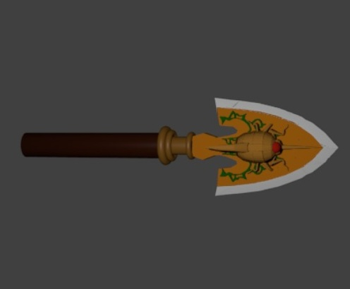
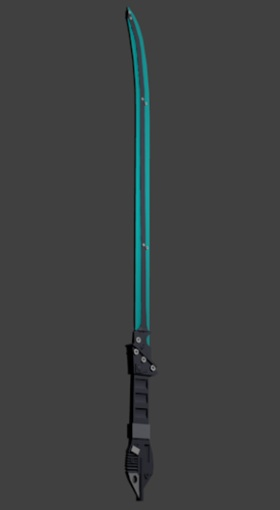
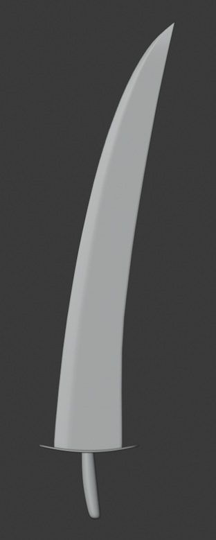
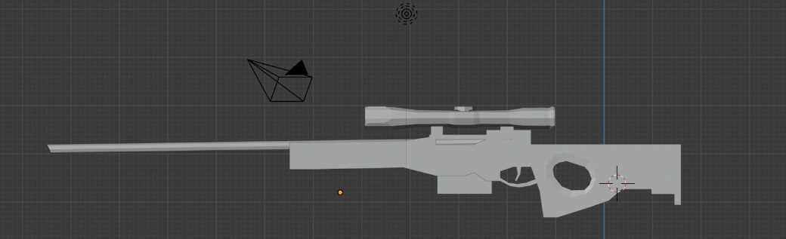
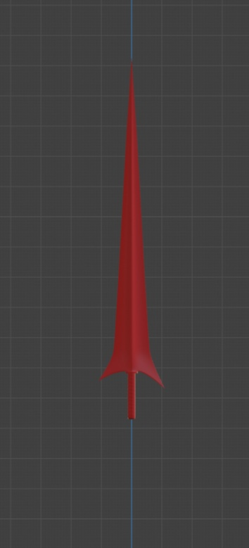
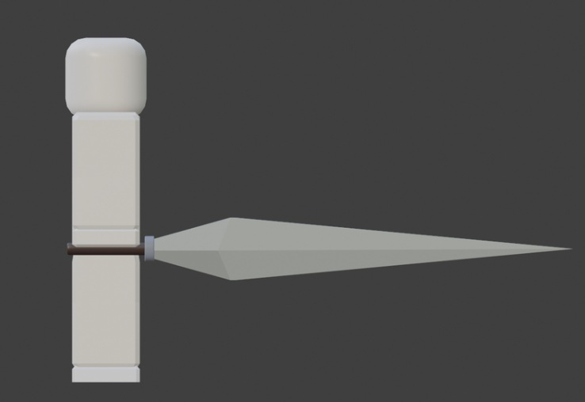
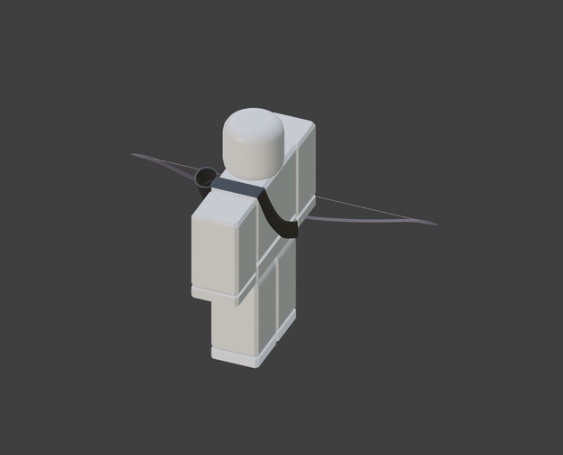
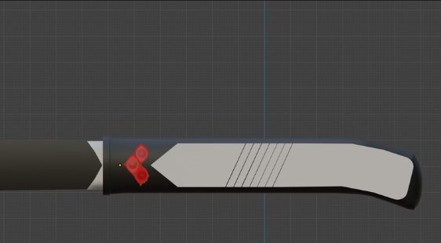

# 3D Weaponry Asset Collection ⚔️
**3D Modeler & Texture Artist | Maya | Blender | Substance Painter | Roblox Studio**

A curated collection of 3D weapons designed for high-performance and visual fidelity. This repository showcases the complete asset pipeline—from initial low-poly wireframes to finalized, game-ready assets. Each model is optimized with clean topology and efficient UV maps to balance visual detail with runtime performance.

---

## 📸 Asset Showcase & Workflow
This collection highlights the transition from 3D geometry to finalized game-ready assets.

| Asset & Wireframe | Technical Highlight |
| :---------------- | :------------------ |
|  | **Complex Geometry:** Detailed recreation of the iconic Requiem Arrow with optimized poly-count. |
|  | **Clean Topology:** Showcases efficient edge flow and wireframe density for melee combat assets. |
|  | **Anime Adaptation:** Translating iconic 2D weapon designs into functional 3D game geometry. |

<b>📂 Click to view full weapon library (Wireframes & Models)</b>

### Wireframe & Geometry Views
* 
* 
* 
* 

### Specialized Assets
* 
* 

---

## 🛠️ Technical Specifications
* **Tools:** Autodesk Maya, Blender, Substance Painter, and Roblox Studio.
* **Optimization:** Low-poly models designed with game performance in mind, ensuring smooth deformation for animations.
* **Workflow:** High-to-low poly baking and efficient UV packing to maximize texture resolution in-engine.

## 📂 Repository Structure
* `documentation/`: High-resolution wireframes and renders of the weapon library.
